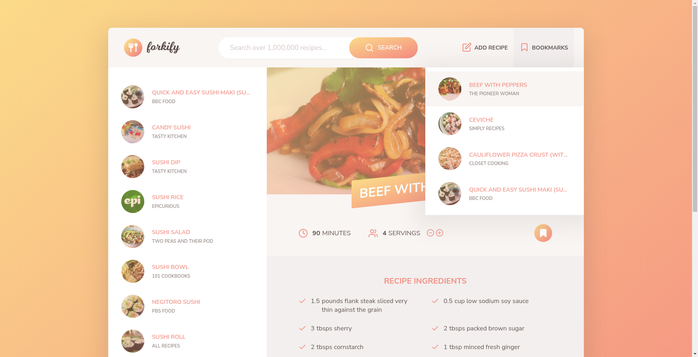

# 🍴Forkify 

JavaScript project, a SPA (single page application) that allows the user to find, bookmark and write recipes, all this in a beatiful and carefully designed interface.
## ⚙️Features
- Search over 1,000,000 and find some inspiration to cook something delicious tonight 😋
- Don't you hate when a recipe is only meant for only 3 or 4 people? You're gonna love this one then, you can define how much people you want to cook for and our powerful algorithm will calculate the exact ingredients quantity you will need.
- Bookmark your favourite recipes to cook them later
- Do you want to add your own recipes? Use our powerful "Add recipe" tool and start writing a new delicious meal 
## 🚀DEMO
What are you waiting for? Get in and start cooking your next delicious meal with [Forkify](https://forkify-luisca.netlify.app/)
## 👀Preview

